# golang-devops-platform

`golang-devops-platform` is a portfolio-ready DevOps project that packages a Go web application into a GitOps delivery workflow using GitHub Actions, Docker, Helm, Argo CD, and Amazon EKS.

The repository shows how application changes move from source control to a running Kubernetes workload without GitHub Actions directly deploying to the cluster. Instead, the pipeline updates the Helm chart in Git, and Argo CD continuously reconciles that desired state into EKS.

## Project Overview

- Application: Go web application built with the standard `net/http` package
- CI platform: GitHub Actions
- Container registry: Docker Hub
- Deployment packaging: Helm
- GitOps controller: Argo CD
- Kubernetes platform: Amazon EKS

## Architecture Diagram

```mermaid
flowchart LR
    A[Developer Push to main] --> B[GitHub Actions CI]
    B --> C[Go Build and Test]
    C --> D[Docker Image Build]
    D --> E[Push Image to Docker Hub]
    E --> F[Update Helm values.yaml Image Tag]
    F --> G[Commit Updated Chart to GitHub]
    G --> H[Argo CD Watches Git Repository]
    H --> I[Render Helm Chart]
    I --> J[Sync Desired State to Amazon EKS]
    J --> K[Kubernetes Rolling Update]
```



## CI/CD Workflow

This repository implements a CI/CD pipeline where GitHub Actions is responsible for continuous integration and image publication, while Argo CD is responsible for continuous delivery.

1. A developer pushes code to the `main` branch.
2. GitHub Actions checks out the repository and runs the Go build and test stages.
3. After the build succeeds, the workflow builds a Docker image for the application.
4. The image is pushed to Docker Hub using the GitHub Actions Docker integration.
5. The workflow updates `helm/go-web-app-chart/values.yaml` with the new image tag.
6. That chart change is committed back to the repository.
7. Argo CD detects the Git change, renders the Helm chart, and synchronizes the new desired state to Amazon EKS.
8. Kubernetes performs a rolling update so the new version replaces the old pods with minimal disruption.

See the workflow definition in [.github/workflows/ci.yaml](./.github/workflows/ci.yaml) and the extended write-up in [docs/architecture.md](./docs/architecture.md).

## GitOps with Argo CD

This project follows a GitOps model:

- Git stores the desired application state, including the Helm chart and image tag.
- GitHub Actions does not run `kubectl apply` or deploy directly to EKS.
- GitHub Actions only builds the Go application, pushes the container image, and updates the Helm chart in Git.
- Argo CD watches the Helm chart path in this repository and reacts to changes in Git.
- Argo CD continuously reconciles the live EKS cluster with the desired state committed to the repository.

The Argo CD application manifest for this repository is provided at [argocd/application.yaml](./argocd/application.yaml). A focused explanation of the model is available in [docs/gitops-flow.md](./docs/gitops-flow.md).

## Amazon EKS Deployment

Amazon EKS is the target runtime environment for the application. Argo CD pulls the Helm chart from this repository, renders the Kubernetes manifests, and applies the desired state to the cluster.

At runtime, the deployment flow is:

- Argo CD detects a new chart commit
- Argo CD syncs the application to the EKS cluster
- Kubernetes rolls out the new container image
- Traffic continues through the Kubernetes service as pods are replaced

This separation keeps the deployment model auditable and consistent: CI produces artifacts and updates Git, while Argo CD handles cluster reconciliation.

## Running the Application Locally

To run the server locally:

```bash
go run main.go
```

The application starts on port `8080`. Open `http://localhost:8080/courses` in your browser.

## Repository Structure

```text
.
|-- .github/workflows/ci.yaml        # GitHub Actions CI pipeline
|-- argocd/application.yaml          # Argo CD Application manifest
|-- docs/architecture.md             # End-to-end platform architecture
|-- docs/gitops-flow.md              # GitOps explanation for this repository
|-- helm/go-web-app-chart/           # Helm chart consumed by Argo CD
|-- k8s/manifests/                   # Raw Kubernetes manifests
|-- static/                          # Static HTML and image assets
|-- Dockerfile                       # Container build definition
|-- main.go                          # Go web application entry point
`-- main_test.go                     # Go test coverage
```

## Documentation

- [Architecture Overview](./docs/architecture.md)
- [GitOps Flow](./docs/gitops-flow.md)
- [Argo CD Application Manifest](./argocd/application.yaml)

## Current UI Preview


## License

This project is licensed under the terms in [LICENSE](./LICENSE).
